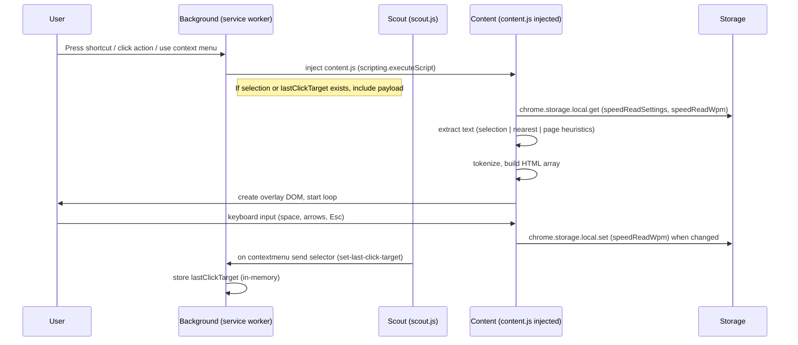

<!--
Generated repository analysis (architect / developer / product manager)
--> 
# Repository Analysis — RSVP Speed Read Chrome Extension

Last scanned: 2026-06-06

This document provides a multi-perspective analysis of the repository as of the scan date: an architectural overview, a developer-focused code walkthrough, and a product-manager view (user journeys, metrics, roadmap). It includes Mermaid diagrams for component and data-flow visualization, implementation notes, testing and security recommendations, and prioritized next steps.

---

**Quick repo snapshot**
- Files of interest:
  - `manifest.json` — extension metadata and permissions
  - `background.js` — service worker / background controller
  - `content.js` — main RSVP engine, injected at runtime
  - `scout.js` — lightweight contextmenu / click-target tracker
  - `options/options.html`, `options/options.js`, `options/options.css` — settings UI
  - `README.md` — user-facing documentation
  - `icons/*` — visual assets

---

## 1. High-level architecture

The extension follows a standard Manifest V3 design: a background service worker (persistent-less), UI action, content script / injected runtime script, and an options page for configuration. The extension uses `chrome.scripting.executeScript` to inject the heavy RSVP overlay (`content.js`) only when needed.

```mermaid
flowchart LR
  UX[User (Keyboard / Context Menu / Action)] -->|keyboard shortcut / action click| BG[Background Service Worker]
  UX -->|right-click menu| BG
  BG -->|inject| CONTENT[content.js (injected)]
  CONTENT --> OVERLAY[SR Overlay (DOM)]
  CONTENT -->|reads/writes| Storage[(chrome.storage.local / sessionStorage)]
  SCOUT[scout.js (content script at document_end)] -->|reports selector| BG
  SCOUT -->|contextmenu listener| BG
  OPTIONS[Options Page] -->|set/get| Storage
  BG -->|message| CONTENT
  OVERLAY -->|keyboard events| CONTENT
```

Notes:
- `scout.js` is registered as a content script in `manifest.json` and runs at `document_end` to capture right-click context and nearest article selector; it posts a short selector string to the background which stores it in-memory for later use when user selects "Speed Read Page".
- `background.js` creates context menu entries and handles commands and action clicks, injecting `content.js` on demand and sending an initial payload describing mode and optional selector/text.
- `content.js` is the runtime engine: extraction heuristics, tokenizer, overlay DOM + styles, RSVP timing loop using requestAnimationFrame.

---

## 2. Component responsibilities (detailed)

- `manifest.json`
  - Declares permissions: `activeTab`, `scripting`, `storage`, `contextMenus`.
  - Registers `background.js` as a service worker (MV3), a content script `scout.js`, and the options page.

- `background.js`
  - Context menu creation: `speed-read-page`, `speed-read-selection`.
  - Listens for `commands.onCommand` (keyboard shortcut) and `action.onClicked`.
  - Injects `content.js` via `chrome.scripting.executeScript` and sends a small payload (mode, text, selector) using `chrome.tabs.sendMessage`.
  - Maintains transient `lastClickTarget` (updated from `scout.js`) to support "nearest-article" mode.

- `scout.js`
  - Lightweight content script (always loaded) that listens for `contextmenu` events and finds a nearest article-like element.
  - Computes a short CSS selector and reports it to the background via `chrome.runtime.sendMessage`.

- `content.js`
  - Main RSVP engine (self-contained IIFE). Responsibilities:
    - Load settings from `chrome.storage.local` (WPM and visual settings).
    - Extract text from the page using simple heuristics (`article`, `main`, role-based, or best `div/section` container with many `<p>` elements).
    - Tokenize text into word objects, flag sentence ends and punctuation.
    - Pre-build HTML for words (focus + rest + punctuation) and then present text using a 5-field overlay (prev2, prev1, focus, next1, next2).
    - Rendering loop: `requestAnimationFrame` + accumulator to drive precise timing per word (`60000/WPM + punctuation delay`).
    - Controls: pause/resume/stop, WPM adjustments (+/- 50), skip sentence left/right, persistent WPM in `chrome.storage.local`, position memory in `sessionStorage`.

- `options/` files
  - Simple vanilla settings UI that reads/writes `chrome.storage.local` keys `speedReadSettings` and `speedReadWpm`.

---

## 3. Sequence diagram (user -> engine)



---

## 4. Developer-focused code walkthrough

### 4.1 Key design decisions observed
- On-demand injection: `content.js` is only injected when the user requests reading — lowers memory footprint.
- Lightweight extraction instead of Readability: smaller, faster, but less robust for extremely varied pages.
- Precomputed DOM fragments for word display: avoids continuous DOM creation during the RSVP loop.
- Use of `sessionStorage` for per-page read position (good for per-tab state) and `chrome.storage.local` for persistent settings.

### 4.2 Important code patterns and considerations
- `background.js`
  - `chrome.scripting.executeScript` callback checks `chrome.runtime.lastError` — good for error visibility but there is no retry fallback.
  - `lastClickTarget` is stored in memory only (not persisted) — survives only until service worker is unloaded. `scout.js` sends updates via runtime message; the service worker holds `lastClickTarget` until it is spun down.

- `content.js`
  - State object centralizes settings and runtime variables — easy to refactor into smaller modules if needed.
  - Tokenization splits sentences and flags punctuation; punctuation is stored on the previous token with `isSentenceEnd` and `punctuation` fields.
  - `buildDisplayHtml` generates HTML strings with highlighted first 1–2 letters using `.sr-focus` and `.sr-rest` spans. Good separation of markup generation and rendering.
  - Timing loop uses an accumulator model which is robust to frame-rate fluctuations — preferred over naive setInterval.
  - `createOverlay` inlines a block of CSS. If theme variations increase, consider extracting CSS into a static file or dynamic class toggles.

### 4.3 Areas for improvement (developer recommendations)
- Background / Scout reliability:
  - The `lastClickTarget` is stored only in-memory in the service worker; when the background service worker is restarted (MV3 frequent), the value may be lost. Consider persisting the selector in `chrome.storage.local` or use `chrome.runtime.connect` keepalive patterns.
- Robust extraction:
  - Current heuristics are fast but brittle on complex sites. Consider optional integration (feature-flagged) with Mozilla Readability or using a conservative DOM cleaning + heuristics to improve recall.
- Testing & modularization:
  - `content.js` is a large IIFE; extract tokenizer, extractor, DOM builder, and UI controller into separate modules/files for unit testing.
  - Add unit tests for `tokenize`, `calculateWordDelay`, and `extractTextLightweight` with representative HTML fixtures.
- Accessibility:
  - Overlay uses very high z-index and captures keyboard events. Add appropriate ARIA roles and a pattern to ensure screen readers can dismiss/ignore overlay; confirm it respects reduced-motion and prefers-contrast settings.
- Error handling:
  - When `chrome.scripting.executeScript` or message sending fails, background logs the error but provides no user-facing fallback. Consider notifying users via `chrome.notifications` or a small visible overlay error.

---

## 5. Product manager perspective

### 5.1 User journeys
- Primary: Discover an article → Press Ctrl+Shift+Y → Overlay appears → Read at adjustable speed → Exit.
- Context-menu flow: Select text or right-click on page → "Speed Read Selection" or "Speed Read Page" → Service worker uses selection or selector to start overlay on relevant content.
- Settings flow: Options page allows persistent defaults (WPM, font size, theme, punctuation pauses).

### 5.2 Core value hypothesis
- Faster focused reading (RS VP) without sending data off-device.
- Low friction: keyboard shortcut + context menu, minimal UI.

### 5.3 Metrics to track (privacy-first)
- Activation rate: number of times overlay started per active user (local analytics optional).
- Retention: repeat activations per user over time.
- Average WPM chosen (user preference signal).
- Completion rate: proportion of initiated reading sessions that reach 75% of content.

Privacy note: extension is offline-first; any analytics must be opt-in and stored locally or via opt-in telemetry.

### 5.4 Product gaps & prioritized roadmap
1. Improve extraction robustness (high priority) — reduces failed reads and increases user satisfaction.
2. Better persist/read last-read position across tabs and browser sessions (medium priority).
3. UX polishing: small onboarding modal and first-run tips (medium priority).
4. Accessibility improvements (high priority): ARIA roles, keyboard focus management, screen-reader behavior.
5. Add lightweight training modes / guided exercises for users to raise comprehension (low/medium).

---

## 6. Security, privacy & permissions analysis
- Permissions in `manifest.json` are reasonable for the feature set: `activeTab`, `scripting`, `storage`, and `contextMenus`.
- The extension does not make network requests or import external resources — good for privacy and supply-chain risks.
- Potential risks:
  - `chrome.scripting.executeScript` executes an extension script in page context; ensure any data extracted is sanitized (the code already cleans nodes and escapes HTML for display).
  - The selector string produced by `scout.js` is a best-effort CSS path; validating or sanitizing before using would be good practice though the code currently uses it only with `document.querySelector`.

Recommendations:
- Consider storing the last-click selector persistently (encrypted? not required) in `chrome.storage.local` with a small TTL if needed, to handle service worker restarts.
- If telemetry is added, make it opt-in and surfaced in the options UI.

---

## 7. Testing recommendations
- Unit tests:
  - Isolate and test `tokenize`, `buildDisplayHtml`, and `calculateWordDelay`.
  - Test `extractTextLightweight` against HTML fixtures (simple article markup, deep nested containers, pages with lots of navigation noise).
- Integration tests:
  - Simulate injection flow: background -> executeScript -> content receives message and starts overlay (use `sinon`/`jsdom` or Puppeteer to automate loaded page).
- Manual QA checklist:
  - Test on list of target sites (news, blogs, docs) to measure extraction success rate.
  - Test keyboard controls and WPM persistence.
  - Test MV3 service worker lifecycle: confirm `scout.js` -> background message delivered consistently when worker restarts.

---

## 8. CI / packaging / release notes
- Currently no CI or packaging manifests are present. For shipping to Chrome Web Store:
  - Validate `manifest.json` (icons, permissions).
  - Build a zip that contains only necessary files.
  - Provide a release changelog in `README.md` or `CHANGELOG.md`.

Suggested CI steps (minimal):
1. Lint JavaScript (ESLint) with consistent style rules.
2. Unit tests for tokenizer and extractor.
3. Zip build artifact and create release draft.

---

## 9. Prioritized next technical tasks (concrete)
1. Persist `lastClickTarget` into `chrome.storage.local` from `scout.js` and read in `background.js` to avoid MV3 service worker volatility.
2. Refactor `content.js` into modules: `extractor.js`, `tokenizer.js`, `ui.js` for testability.
3. Add ARIA attributes to overlay and provide dismiss hints for screen readers.
4. Create small test harness (node + jsdom) to unit test `tokenize` and `calculateWordDelay`.

---

## 10. How to iterate locally (dev notes)
1. Open `chrome://extensions` → enable Developer Mode → Load unpacked → select repository folder.
2. Use `Ctrl+Shift+Y` to launch on any page or right-click to use context menu.
3. For debugging `background.js`, open the Extensions page, click "Service worker" link to open console; for `content.js`, open the page console.

Commands (Windows PowerShell):
```
# Zip for release (from repo root)
# Remove dev files if any, then:
Compress-Archive -Path * -DestinationPath speed-read-chrome-extension.zip
```

---

## Appendix — File-level notes
- [manifest.json](manifest.json#L1-L50): MV3, permissions and content script registration.
- [background.js](background.js#L1-L200): context menu, injection logic, runtime messaging.
- [content.js](content.js#L1-L999): main engine; split into sections: settings load/save, extraction, tokenization, DOM overlay, timing loop, input handling.
- [scout.js](scout.js#L1-L200): selector generation and contextmenu listener.
- [options/options.js](options/options.js#L1-L200): straightforward storage-backed settings UI.

---

If you want, I can:
- Open a PR that implements `lastClickTarget` persistence and small refactor of `background.js` error handling.
- Create unit tests for `tokenize` and `calculateWordDelay` and add a lightweight test runner.

Tell me which next step you'd like me to take.
